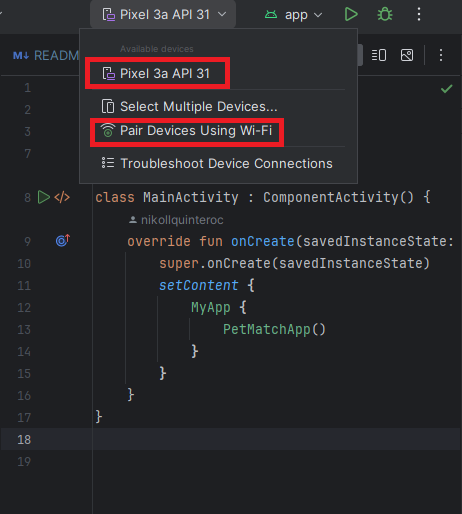
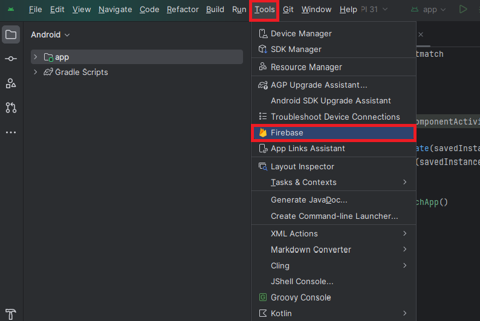

# PetMatch
Proyecto MVP sobre una aplicación para la gestión de reserva de servicio de cuidado de mascotas. de simulación laboral usando el lenguaje kotlin. Este proyecto fue desarrollado durante una simulación laboral de NoCountry.

## Tabla de contenido
* [Información general](#informacion-general)
* [Tecnologías utilizadas](#tecnologias-utilizadas)
* [Características](#caracteristicas)
* [Reglas de negocio](#reglas-negocio)
* [Configuración del entorno](#configuracion-entorno)
	* [Prerrequisitos](#prerrequisitos)
	* [Repositorio](#repositorio)
	* [Android Studio](#android-studio)
	* [Base de datos](#base-de-datos)

<a id= "informacion-general"></a>
## Información general
Las mascotas son parte escencial en la vida de gran cantidad de personas, estos fieles acompañantes requieren cuidados especiales para mantenerse sanos y felices, es por esto que surge PetMatch, una aplicación cuyo propósito es facilitar el encuentro entre dueños de mascotas y cuidadores. La apliación permite la gestión de reserva de servicio de cuidado de mascotas, facilitando la comunicación y el compartir de información relevante para ambas partes, elevendado asi el nivel de satisfacción de los involucrados.

<a id= "tecnologias-utilizadas"></a>
## Tecnologías utilizadas
- Kotlin - Jetpack Compose - MVVM - Coil
- Firebase suite - Auth - Realtime database.
- Gestión del proyecto: Jira, Slack y Discord

<a id= "caracteristicas"></a>
## Características
- Registro de usuarios.
- Autentificación de usuarios.
- Visualización de listado de cuidadores de mascotas.
- Gestión del proceso de reserva de servicio entre dueños de mascotas y cuidadores.
- Gestión del perfil del usuario.

<a id= "reglas-negocio"></a>
## Reglas de negocio
- Los roles validos para un usuario son "Administrador", "Dueño" y "Cuidador".
- Las mascotas aceptadas para registrarse son solo perros y gatos.
- Una mascota pertenece solo a un usuario dueño.
- Los servicios de cuidado ofrecidos solo son "Baño", "Paseo" (de 1 a 4 horas) y "Cuidado en casa" (el cuidador se queda con la mascota en la residencia del dueño entre 1 y 8 horas). 

<a id= "configuracion-entorno"></a>
## Configuración del entorno

### Prerrequisitos
Para ejecutar el proyecto es necesario tener cuentas en plataformas específicas y tener instaladas algunas herramientas:


### Repositorio
Clona el repositorio en un directorio de tu conveniencia. Una forma de hacerlo es mediante comandos de consola.

```bash
cd <nombre del directorio del proyecto>
git clone <URL del repositorio>
```

### Android Studio
La primera vez que abras el proyecto hay que esperar a que Gradle haga las configuraciones y descarga necesarias.


Para poder ejecutar la aplicación es necesario una de las siguientes cosas:

1. Crear un dispositivo virtual.
2. Concetar un celular al emulador.

La opción 1 se hace mediante la opcion "Device Manager" el menu lateral. Durante la creación es necesario seleccionar el modelo del celular y la versión de android (hay que descargar una imagen del sistema operativo si no se ha hecho previamente).


La opción 2 se realiza mediante la lista desplegable de "Available devices" del menu superior y central.



### Base de datos
Necesitas tener una cuenta en Firebase para poder crear una base de datos y conectarla con el proyecto. 

Desde Android Studio es posible empezar el proceso de creación y conexión entre firebase y el proyecto, para ello hay que darle click a la opción "Tools" del menu superior y luego darle click a la opción "Firebase".



Esta opción abre un asistente que cuenta con la documentación necesaria para realizar la conexión. Despliega la sección "Realtime Database" y sigue los pasos indicados.

